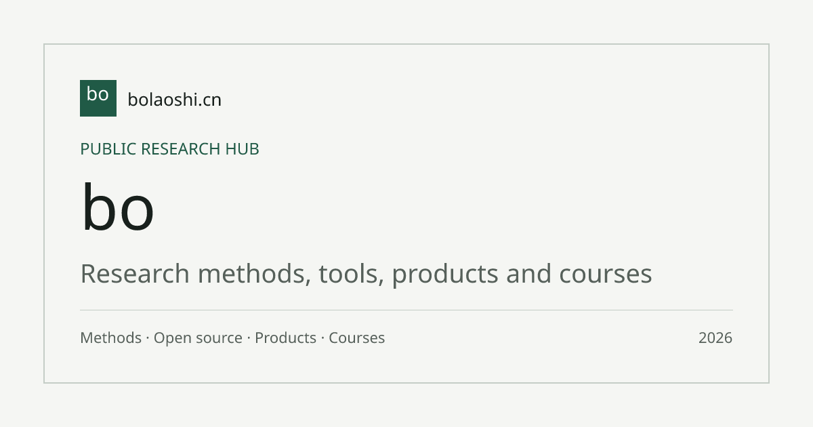

# 科研开源能力图谱

[English](README.en.md)

这是一份由 bo老师持续维护的科研开源仓库与 Skill 能力索引。当前收录 52 个条目，每个条目都保留来源、读取版本、核对日期、许可状态、能力机制、适用任务、限制和人工检查点。

## 为什么公开

科研工具的名字很多，真正影响选择的是它能完成什么、需要什么输入、会产生什么输出、哪些环节必须由人检查。这个仓库把官网中的原创分析转换为可下载、可引用和可继续处理的结构化数据。

## 已分析的 Skill 与开源库

默认按 GitHub Stars 从高到低排列。GitHub 是开源项目的主要发布平台；Stars 是 GitHub 用户对项目的公开收藏数，可以观察关注度，不能代替质量判断。点击名称可以直接阅读 Markdown 分析，点击 GitHub 可以进入原仓库。

| 名称 | 解决什么 | 科研阶段 | GitHub Stars | 原仓库 | 详细分析 |
| --- | --- | --- | ---: | --- | --- |
| [Academic Research Skills](docs/academic-research-skills.md) | 在Claude Code中将研究、写作、审稿和修订串成可追溯的学术论文全流程 | 起步、文献、研究设计、验证、写作 | 37,312 | [GitHub](https://github.com/Imbad0202/academic-research-skills) | [官网详情](https://bolaoshi.cn/research-tools/academic-research-skills) |
| [Scientific-Agent-Skills](docs/scientific-agent-skills.md) | 为AI科研代理提供文献检索、写作、统计、实验设计和同行评审的结构化能力。 | 文献、研究设计、数据分析、写作 | 30,670 | [GitHub](https://github.com/K-Dense-AI/scientific-agent-skills) | [官网详情](https://bolaoshi.cn/research-tools/scientific-agent-skills) |
| [Nature Skills](docs/nature-skills.md) | 覆盖论文精读、写作、润色、审稿回应与数据治理全流程的科研 Skill 集合 | 文献、写作、验证 | 27,794 | [GitHub](https://github.com/Yuan1z0825/nature-skills) | [官网详情](https://bolaoshi.cn/research-tools/nature-skills) |
| [MLflow](docs/mlflow.md) | AI工程平台，统一管理ML实验、LLM追踪、模型注册和部署 | 数据分析、验证、研究设计 | 26,974 | [GitHub](https://github.com/mlflow/mlflow) | [官网详情](https://bolaoshi.cn/research-tools/mlflow) |
| [ChatPaper](docs/chatpaper.md) | 用LLM进行论文搜索、阅读、翻译、审稿和综述草稿生成 | 文献、写作 | 19,664 | [GitHub](https://github.com/kaixindelele/ChatPaper) | [官网详情](https://bolaoshi.cn/research-tools/chatpaper) |
| [DeepCode](docs/deepcode.md) | 从论文或需求文本自动生成可复现代码的智能编程工具 | 数据分析、验证 | 16,025 | [GitHub](https://github.com/HKUDS/DeepCode) | [官网详情](https://bolaoshi.cn/research-tools/deepcode) |
| [DVC](docs/dvc.md) | 数据与模型版本管理工具，为机器学习项目提供可复现流水线 | 数据分析、验证 | 15,739 | [GitHub](https://github.com/iterative/dvc) | [官网详情](https://bolaoshi.cn/research-tools/dvc) |
| [Unstructured](docs/unstructured.md) | 把PDF/HTML/Word/图片等非结构化文档转成LLM可消费的结构化元素列表 | 文献、数据分析、写作 | 15,106 | [GitHub](https://github.com/Unstructured-IO/unstructured) | [官网详情](https://bolaoshi.cn/research-tools/unstructured) |
| [AI Scientist](docs/ai-scientist.md) | 从研究想法自动生成、实验验证到论文发表的端到端科研流水线 | 起步、文献、数据分析、验证、写作 | 14,197 | [GitHub](https://github.com/SakanaAI/AI-Scientist) | [官网详情](https://bolaoshi.cn/research-tools/ai-scientist) |
| [ARIS (Auto-Claude-Code-Research-in-Sleep)](docs/auto-claude-code-research-in-sleep.md) | 用Markdown skill编排从选题到论文写作的科研全流程自动化 | 起步、研究设计、数据分析、验证、写作 | 13,266 | [GitHub](https://github.com/wanshuiyin/Auto-claude-code-research-in-sleep) | [官网详情](https://bolaoshi.cn/research-tools/auto-claude-code-research-in-sleep) |
| [statsmodels](docs/statsmodels.md) | 用经典统计推断方法做回归、时间序列、面板分析和假设检验。 | 数据分析、验证 | 11,503 | [GitHub](https://github.com/statsmodels/statsmodels) | [官网详情](https://bolaoshi.cn/research-tools/statsmodels) |
| [AI Research SKILLs](docs/ai-research-skills.md) | 面向AI研究Agent的大型技能库，覆盖从构思到论文的科研全流程 | 起步、文献、研究设计、数据分析、验证、写作 | 10,603 | [GitHub](https://github.com/Orchestra-Research/AI-Research-SKILLs) | [官网详情](https://bolaoshi.cn/research-tools/ai-research-skills) |
| [PyMC](docs/pymc.md) | 用代码声明贝叶斯概率模型，通过MCMC或变分推断估计参数后验分布。 | 数据分析、验证 | 9,674 | [GitHub](https://github.com/pymc-devs/pymc) | [官网详情](https://bolaoshi.cn/research-tools/pymc) |
| [paper-qa](docs/paper-qa.md) | 从本地论文和文档中检索证据并生成带精确引用的科研答案 | 文献、验证 | 8,849 | [GitHub](https://github.com/Future-House/paper-qa) | [官网详情](https://bolaoshi.cn/research-tools/paper-qa) |
| [DoWhy](docs/dowhy.md) | 端到端因果推断库，用四步流水线统一因果建模、识别、估计与反驳 | 研究设计、数据分析、验证 | 8,208 | [GitHub](https://github.com/py-why/dowhy) | [官网详情](https://bolaoshi.cn/research-tools/dowhy) |
| [Zotero GPT](docs/zotero-gpt.md) | 在Zotero内用GPT对论文全文进行问答、翻译、润色，并把结果写回笔记 | 文献、写作 | 7,251 | [GitHub](https://github.com/MuiseDestiny/zotero-gpt) | [官网详情](https://bolaoshi.cn/research-tools/zotero-gpt) |
| [arXiv LaTeX Cleaner](docs/arxiv-latex-cleaner.md) | 一键清理LaTeX工程并优化体积，准备arXiv提交包 | 写作 | 6,939 | [GitHub](https://github.com/google-research/arxiv-latex-cleaner) | [官网详情](https://bolaoshi.cn/research-tools/arxiv-latex-cleaner) |
| [AI Scientist v2](docs/ai-scientist-v2.md) | 从开放研究主题到论文产出的端到端自动化科研流水线 | 起步、文献、研究设计、数据分析、验证、写作 | 6,800 | [GitHub](https://github.com/SakanaAI/AI-Scientist-v2) | [官网详情](https://bolaoshi.cn/research-tools/ai-scientist-v2) |
| [Papermill](docs/papermill.md) | 让 Jupyter Notebook 变成可用不同参数批量执行的参数化计算单元 | 数据分析、验证 | 6,460 | [GitHub](https://github.com/nteract/papermill) | [官网详情](https://bolaoshi.cn/research-tools/papermill) |
| [causalml](docs/causalml.md) | 用机器学习估计个体处理效应并做uplift建模与策略优化 | 数据分析、验证 | 5,920 | [GitHub](https://github.com/uber/causalml) | [官网详情](https://bolaoshi.cn/research-tools/causalml) |
| [Agent Laboratory](docs/agentlaboratory.md) | 用多Agent自动完成文献检索、实验代码生成和论文写作的研究流水线 | 起步、文献、研究设计、数据分析、验证、写作 | 5,741 | [GitHub](https://github.com/SamuelSchmidgall/AgentLaboratory) | [官网详情](https://bolaoshi.cn/research-tools/agentlaboratory) |
| [Zotero arXiv Daily](docs/zotero-arxiv-daily.md) | 根据你的Zotero文献库兴趣画像，每日自动推荐arXiv/bioRxiv/medRxiv新论文到邮箱 | 起步、文献 | 5,675 | [GitHub](https://github.com/TideDra/zotero-arxiv-daily) | [官网详情](https://bolaoshi.cn/research-tools/zotero-arxiv-daily) |
| [AI Researcher](docs/ai-researcher.md) | 把机器学习研究想法或参考论文自动转成可运行实验和LaTeX论文 | 文献、研究设计、数据分析、验证、写作 | 5,576 | [GitHub](https://github.com/HKUDS/AI-Researcher) | [官网详情](https://bolaoshi.cn/research-tools/ai-researcher) |
| [Research-Paper-Writing-Skills](docs/research-paper-writing-skills.md) | 按章节拆分论文写作任务，用结构化模板和claim-evidence对齐检查提升稿件质量。 | 写作 | 4,998 | [GitHub](https://github.com/Master-cai/Research-Paper-Writing-Skills) | [官网详情](https://bolaoshi.cn/research-tools/research-paper-writing-skills) |
| [grobid](docs/grobid.md) | 把学术论文PDF解析成结构化TEI XML，提取元数据、全文结构和参考文献 | 文献、数据分析、写作 | 4,985 | [GitHub](https://github.com/kermitt2/grobid) | [官网详情](https://bolaoshi.cn/research-tools/grobid) |
| [Paper2Code](docs/paper2code.md) | 把机器学习论文自动转为复现计划、代码文件和评估报告 | 研究设计、数据分析、验证 | 4,795 | [GitHub](https://github.com/going-doer/Paper2Code) | [官网详情](https://bolaoshi.cn/research-tools/paper2code) |
| [EconML](docs/econml.md) | 异质性处理效应估计库，用正交机器学习估计个体化因果效应 | 研究设计、数据分析 | 4,708 | [GitHub](https://github.com/py-why/EconML) | [官网详情](https://bolaoshi.cn/research-tools/econml) |
| [claude-scholar](docs/claude-scholar.md) | 半自动化科研助手，用证据契约机制贯穿选题、实验分析、写作到审稿响应 | 起步、文献、数据分析、验证、写作 | 4,573 | [GitHub](https://github.com/Galaxy-Dawn/claude-scholar) | [官网详情](https://bolaoshi.cn/research-tools/claude-scholar) |
| [Sacred](docs/sacred.md) | 自动记录每次计算实验的配置、种子、依赖和结果，让实验可追溯、可复现。 | 数据分析、验证 | 4,367 | [GitHub](https://github.com/IDSIA/sacred) | [官网详情](https://bolaoshi.cn/research-tools/sacred) |
| [AutoFigure-Edit](docs/autofigure-edit.md) | 把论文方法文本或已有位图转成可编辑SVG插图并自动替换图标 | 写作 | 3,949 | [GitHub](https://github.com/ResearAI/AutoFigure-Edit) | [官网详情](https://bolaoshi.cn/research-tools/autofigure-edit) |
| [Supervisor-Skills](docs/supervisor-skills.md) | 把导师的经验方法拆成7个AI可调用的技能，覆盖从idea评估到投稿审查全流程。 | 起步、研究设计、写作、验证 | 3,840 | [GitHub](https://github.com/HKUSTDial/Supervisor-Skills) | [官网详情](https://bolaoshi.cn/research-tools/supervisor-skills) |
| [pgmpy](docs/pgmpy.md) | 用图结构编码变量间的概率依赖和因果假设，做条件推断、因果发现与合成数据生成。 | 研究设计、数据分析、验证 | 3,295 | [GitHub](https://github.com/pgmpy/pgmpy) | [官网详情](https://bolaoshi.cn/research-tools/pgmpy) |
| [DeepScientist](docs/deepscientist.md) | 本地优先的科研操作系统，用多Agent自动推进研究全流程 | 起步、文献、研究设计、数据分析、验证、写作 | 3,179 | [GitHub](https://github.com/ResearAI/DeepScientist) | [官网详情](https://bolaoshi.cn/research-tools/deepscientist) |
| [arxiv-mcp-server](docs/arxiv-mcp-server.md) | 让AI助手通过MCP协议搜索、下载和阅读arXiv论文 | 文献 | 2,950 | [GitHub](https://github.com/blazickjp/arxiv-mcp-server) | [官网详情](https://bolaoshi.cn/research-tools/arxiv-mcp-server) |
| [OpenClaw Medical Skills](docs/openclaw-medical-skills.md) | 869 个面向临床研究、生物信息学和药物发现的医疗与生物医学 Skill 集合 | 文献、研究设计、验证 | 2,826 | [GitHub](https://github.com/FreedomIntelligence/OpenClaw-Medical-Skills) | [官网详情](https://bolaoshi.cn/research-tools/openclaw-medical-skills) |
| [Auto-Empirical-Research-Skills](docs/auto-empirical-research-skills.md) | 面向实证研究的agent skill发行仓，含完整pipeline、质量门和许可审计 | 研究设计、数据分析、验证、写作 | 2,790 | [GitHub](https://github.com/brycewang-stanford/Auto-Empirical-Research-Skills) | [官网详情](https://bolaoshi.cn/research-tools/auto-empirical-research-skills) |
| [PapersGPT for Zotero](docs/papersgpt-for-zotero.md) | 在 Zotero 内直接用 LLM 对论文 PDF 提问并点击答案回到原文位置 | 文献 | 2,504 | [GitHub](https://github.com/papersgpt/papersgpt-for-zotero) | [官网详情](https://bolaoshi.cn/research-tools/papersgpt-for-zotero) |
| [Science-Skills](docs/science-skills.md) | 为AI科研助手提供37个可调用的生物信息学数据库查询和分子分析能力。 | 文献、研究设计、数据分析 | 2,330 | [GitHub](https://github.com/google-deepmind/science-skills) | [官网详情](https://bolaoshi.cn/research-tools/science-skills) |
| [llm-for-zotero](docs/llm-for-zotero.md) | Zotero插件，让LLM在论文库中阅读、检索、对比和写笔记 | 文献、写作、起步 | 2,227 | [GitHub](https://github.com/yilewang/llm-for-zotero) | [官网详情](https://bolaoshi.cn/research-tools/llm-for-zotero) |
| [Claude Scientific Writer](docs/claude-scientific-writer.md) | 科研写作工具包，覆盖论文、基金、临床报告和视觉产物的生成 | 文献、写作、验证 | 2,083 | [GitHub](https://github.com/K-Dense-AI/claude-scientific-writer) | [官网详情](https://bolaoshi.cn/research-tools/claude-scientific-writer) |
| [AutoFigure](docs/autofigure.md) | 把论文方法文本或描述转成科研图代码，评审迭代后输出可编辑SVG | 写作 | 1,735 | [GitHub](https://github.com/ResearAI/AutoFigure) | [官网详情](https://bolaoshi.cn/research-tools/autofigure) |
| [causal-learn](docs/causal-learn.md) | 从观测数据中自动学习变量间的因果结构图，覆盖三大流派 | 研究设计、数据分析 | 1,646 | [GitHub](https://github.com/py-why/causal-learn) | [官网详情](https://bolaoshi.cn/research-tools/causal-learn) |
| [PaSa](docs/pasa.md) | 把复杂学术问题拆成多条搜索式，自动检索并筛选最相关论文 | 起步、文献 | 1,622 | [GitHub](https://github.com/bytedance/pasa) | [官网详情](https://bolaoshi.cn/research-tools/pasa) |
| [ToolUniverse](docs/tooluniverse.md) | 把1000+科学工具统一封装成LLM可调用的标准协议，用一次对话发现并执行它们 | 文献、研究设计、数据分析 | 1,561 | [GitHub](https://github.com/mims-harvard/ToolUniverse) | [官网详情](https://bolaoshi.cn/research-tools/tooluniverse) |
| [OpenScholar](docs/openscholar.md) | 用检索增强生成回答科研问题，并自动插入带编号的引用文献 | 文献、写作 | 1,557 | [GitHub](https://github.com/AkariAsai/OpenScholar) | [官网详情](https://bolaoshi.cn/research-tools/openscholar) |
| [medical-research-skills](docs/medical-research-skills.md) | 554个医学研究专用skill，覆盖协议设计到写作合规的全生命周期 | 研究设计、数据分析、写作、文献、验证 | 1,397 | [GitHub](https://github.com/aipoch/medical-research-skills) | [官网详情](https://bolaoshi.cn/research-tools/medical-research-skills) |
| [MetaScreener](docs/metascreener.md) | 多LLM协作的系统综述自动化平台，从检索到偏倚评估全链路 | 文献、验证、写作 | 1,319 | [GitHub](https://github.com/ChaokunHong/MetaScreener) | [官网详情](https://bolaoshi.cn/research-tools/metascreener) |
| [MedRAX](docs/medrax.md) | ICML 2025胸片推理agent，用LLM调度多个专用模型回答临床问题 | 数据分析、验证 | 1,194 | [GitHub](https://github.com/bowang-lab/MedRAX) | [官网详情](https://bolaoshi.cn/research-tools/medrax) |
| [infiAgent](docs/infiagent.md) | 用YAML配置多层agent完成跨小时/跨天的全流程科研任务 | 起步、文献、研究设计、数据分析、写作 | 1,181 | [GitHub](https://github.com/polyuiislab/infiAgent) | [官网详情](https://bolaoshi.cn/research-tools/infiagent) |
| [CausalPy](docs/causalpy.md) | 用贝叶斯方法做准实验因果推断，含10+方法和稳健性诊断套件 | 研究设计、数据分析、验证 | 1,162 | [GitHub](https://github.com/pymc-labs/CausalPy) | [官网详情](https://bolaoshi.cn/research-tools/causalpy) |
| [AgentSociety](docs/agentsociety.md) | 用LLM驱动的大规模社会模拟平台，支撑计算社会科学全流程研究 | 文献、研究设计、数据分析、写作 | 1,118 | [GitHub](https://github.com/tsinghua-fib-lab/AgentSociety) | [官网详情](https://bolaoshi.cn/research-tools/agentsociety) |
| [linearmodels](docs/linearmodels.md) | Python面板回归与工具变量估计库，处理内生性和多维面板数据 | 数据分析、研究设计 | 1,052 | [GitHub](https://github.com/bashtage/linearmodels) | [官网详情](https://bolaoshi.cn/research-tools/linearmodels) |

## 浏览入口

- 官网目录：https://bolaoshi.cn/research-tools
- 数据集：data/research-tools.json
- 数据结构：data/schema.json
- 条目索引：docs/index.md
- bo老师官网：https://bolaoshi.cn

## 数据边界

仓库发布原创分析、公开事实元数据、上游链接和版本快照信息。它不发布上游项目代码，也不替代上游文档。许可状态只代表核对时的公开结果，使用前请再次查看原仓库。

## 更新方式

网站保存完整阅读页面，这个仓库保存同一批准快照的数据和 Markdown。上游项目变化后，先比较版本与校验值，再更新分析。数据字段变化会同步提高 schemaVersion 并记录在 CHANGELOG.md。

## 许可

bo老师原创的分析、结构和数据采用 Creative Commons Attribution 4.0 International。上游项目、代码、名称和商标继续遵循各自许可。引用时请保留作者、仓库地址和官网详情页。

## 反馈

来源变化、许可修正和事实错误可以通过 GitHub Issue 提交。方法讨论和课程咨询请访问 https://bolaoshi.cn/about。
